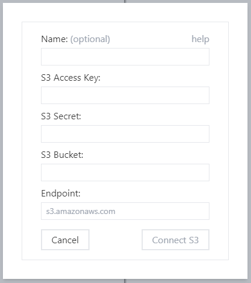

# S3 support

You can connect any S3-compatible storage service:

The important information:
* access key and secret are API keys needed to access
  * you can use existing keys or generate keys just for Filerion (so that you have an option to revoke Filerion access)
  * if you want to upload, make sure to enable write access
* bucket and endpoint identify the storage
* name is optional. We show it in the list of configured services

## Configuring Amazon S3
To see your buckets visit https://s3.console.aws.amazon.com/s3/buckets

For endpoint you can use s3.amazonaws.com 

To create access keys, visit https://us-east-1.console.aws.amazon.com/iam/home?region=us-east-1#/security_credentials (Access keys (access key ID and secret access key
 section)

Note: those links are valid as of 2022 June. Amazon might change their UI in the future.

## S3 and directories

S3 (and compatible storage services) don’t have a concept of directory and therefore you can’t create an empty directory.

S3 is key / value object storage. The key is the name of the object.

Only by convention we consider `/` in key name to indicate a new directory.

To create an empty directory `/foo/` we create a hidden file `/foo/.filerion.keep`.
