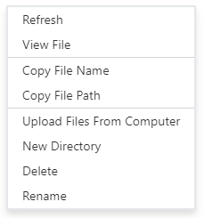

# Upload files from your computer

You can upload files from your computer to Dropbox, S3 (and any other connected file system) by drag & drop from desktop or File Explorer (on Windows) or Finder (on Mac).

You can also right click to get context menu:

And use `Upload Files From Computer` menu item.
